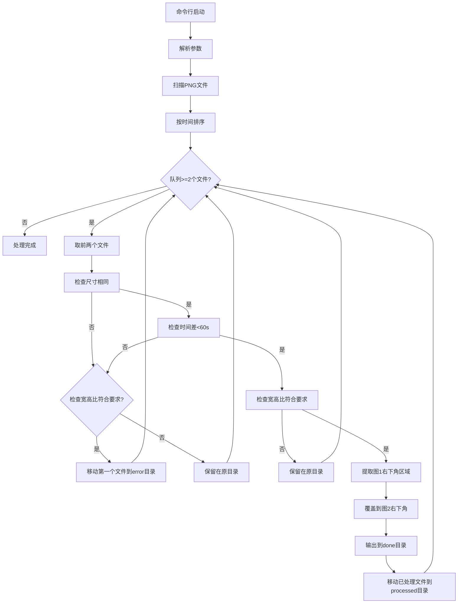

## 1. Product Overview

一个基于Node.js的命令行工具，使用ImageMagick自动处理PNG图片的智能合并。
- 自动扫描指定目录下的PNG文件，按创建时间排序，智能匹配并合并图片
- 支持多重匹配条件检查（尺寸、时间差、宽高比），确保合并质量
- 提供完整的文件分类管理系统，确保工作目录清洁
- 支持中英文双语界面，提供国际化用户体验

## 2. Core Features

### 2.1 User Roles

本工具无需用户角色区分，所有用户均可直接使用命令行工具的完整功能。

### 2.2 Feature Module

[Specifications]
我们的图片合并工具需求包含以下主要模块：
1. **命令行界面**：参数解析、帮助信息显示、语言选择、双语支持
2. **图片扫描模块**：PNG文件发现、创建时间排序
3. **图片匹配模块**：尺寸检查、时间差验证、宽高比检查
4. **图片合并模块**：ImageMagick处理、区域覆盖合成、输出重定向
5. **文件管理模块**：目录创建、文件分类、清理操作
6. **统计报告模块**：处理结果统计、双语输出显示
7. **国际化模块**：语言检测、文本翻译、界面切换

### 2.3 Page Details

| 命令行界面 | 参数解析 | 解析工作目录、详细输出、语言选择等命令行参数 |
| 命令行界面 | 帮助信息 | 显示工具使用说明和参数列表，支持双语 |
| 图片扫描模块 | 文件发现 | 扫描指定目录下所有PNG文件 |
| 图片扫描模块 | 时间排序 | 按文件创建时间升序排列 |
| 图片匹配模块 | 尺寸检查 | 验证两个图片的宽高是否相同 |
| 图片匹配模块 | 时间差检查 | 确保两个图片创建时间差小于60秒 |
| 图片匹配模块 | 宽高比检查 | 验证图片宽高比是否为支持的比例（1:1,2:3,3:2,4:3,3:4,9:16,16:9） |
| 图片合并模块 | 区域提取 | 从第一张图片右下角提取150x75像素区域 |
| 图片合并模块 | 图片覆盖 | 将提取区域覆盖到第二张图片上 |
| 图片合并模块 | 文件输出 | 生成合并后的PNG文件到done目录，使用毫秒级时间戳命名 |
| 图片合并模块 | 输出重定向 | 抑制ImageMagick命令的所有输出信息 |
| 文件管理模块 | 目录创建 | 自动创建processed、error、done目录 |
| 文件管理模块 | 文件移动 | 将处理过的文件移动到相应目录，仅支持宽高比的图片移入error |
| 文件管理模块 | 清理操作 | 确保工作目录下无PNG文件残留 |
| 统计报告模块 | 数据统计 | 统计总文件数、成功合并数、错误数 |
| 统计报告模块 | 结果显示 | 以彩色文本显示处理结果，支持双语输出 |
| 国际化模块 | 语言检测 | 自动检测系统语言，默认选择界面语言 |
| 国际化模块 | 文本翻译 | 提供中英文文本翻译功能 |
| 国际化模块 | 界面切换 | 支持通过命令行参数切换界面语言 |

## 3. Core Process

用户通过命令行启动工具，可指定工作目录、详细输出和界面语言等参数。工具首先扫描目录下的PNG文件，按创建时间排序后进行配对处理。对每一对图片进行匹配条件检查（尺寸相同、时间差小于60秒、宽高比符合要求），通过检查的图片对进行合并处理，将第一张图片右下角150x75像素区域覆盖到第二张图片上，生成的文件使用毫秒级时间戳命名避免冲突。处理完成的文件分别移动到processed目录，合并结果保存到done目录。只有宽高比符合要求的文件在不满足其他条件时才移动到error目录，不符合宽高比的文件保留在原目录。最后显示双语处理统计信息并确保工作目录清洁。

## 4. User Interface Design

### 4.1 Design Style

- 主色调：蓝色系（#2196F3）用于信息提示，绿色系（#4CAF50）用于成功状态
- 辅助色：红色系（#F44336）用于错误提示，灰色系（#9E9E9E）用于次要信息
- 输出风格：使用chalk库实现彩色终端输出，提升用户体验
- 图标风格：使用Unicode表情符号增强视觉效果（🖼️📁🔍✅❌🌐等）
- 布局风格：简洁的命令行界面，清晰的信息层次结构
- 国际化设计：支持中英文界面切换，保持一致的视觉风格

### 4.2 Page Design Overview

| 命令行界面 | 参数解析 | 彩色帮助文本，清晰的参数说明，错误提示，双语支持 |
| 命令行界面 | 启动信息 | 蓝色标题，工作目录显示，分隔线装饰，语言标识 |
| 图片处理 | 进度提示 | 扫描、排序、匹配、合并各阶段的状态图标，双语文本 |
| 文件操作 | 移动提示 | 不同颜色区分processed、error、done目录，双语说明 |
| 统计报告 | 结果展示 | 表格式布局，数字高亮，成功/失败状态区分，双语输出 |
| 国际化界面 | 语言切换 | 统一的视觉风格，保持图标和颜色一致性 |

### 4.3 Responsiveness

作为命令行工具，主要考虑终端窗口宽度适配，确保在不同终端尺寸下都能正常显示进度和结果信息。
